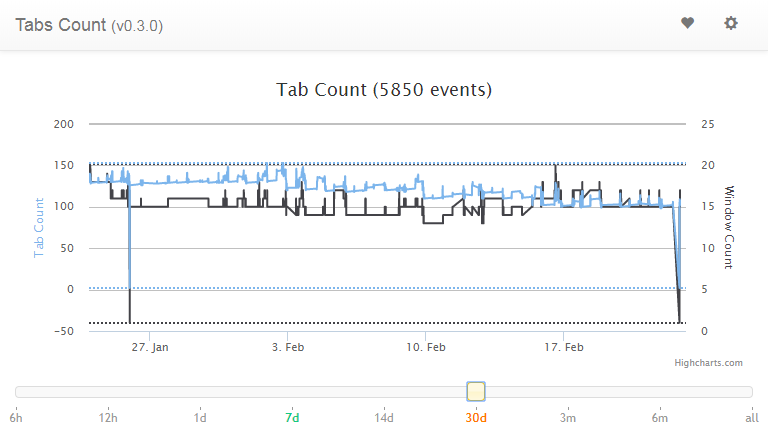

# Chrome Tabs Count
Chrome Tabs Count is a small [Chrome](http://www.google.com/chrome/) extension to track the number of tabs and windows you have opened.

## Requirements
* [Chrome](http://www.google.com/chrome/)

### Requirements to compile
* npm or yarn

## Getting started
* run `npm install` or `yarn install`
* run `grunt build:release` to build the assets

## License
The code is licensed under the [MIT license](http://choosealicense.com/licenses/mit/). See LICENSE.
